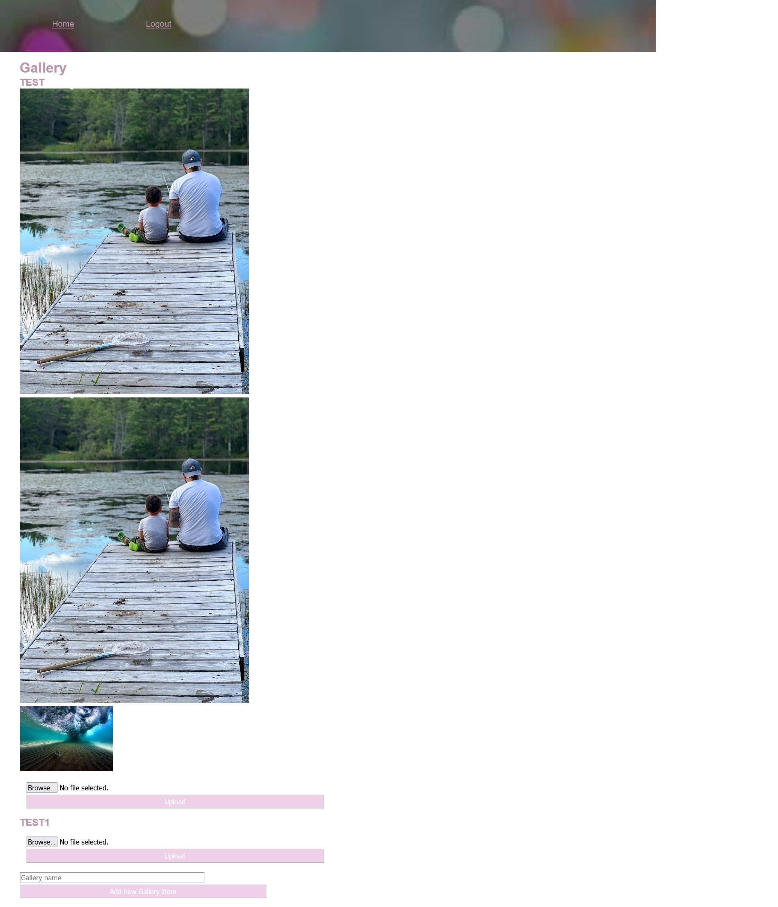

# The Art Gallery

- [x] Use Node.js and Express.js to create a RESTful API.
- [x] Use a template engine such as Handlebars.js.
- [x] Use MySQL and the Sequelize ORM for the database.
- [x] Have both GET and POST routes for retrieving and adding new data.
- [x] Deploy using Heroku (with data).
- [x] Use at least one new library, package, or technology that we haven’t discussed
- [x] Have a polished UI
- [x] Be responsive.
- [x] Be interactive (i.e., accept and respond to user input).
- [x] Must have a folder structure that meets the MVC paradigm.
- [x] Must include authentication (cookies and express-session).
- [x] Must protect API keys and sensitive information with environment variables.
- [x] Have a clean repository that meets quality coding standards (file structure, naming conventions, follows best practices for class/id naming conventions, indentation, quality comments, etc.).
- [x] Have a quality README (with unique name, description, technologies used, screenshot, and link to deployed application).
- [x] Add your project to the portfolio that you created in Module 2.

# User Story

- As a user
- I want to sign up for an app that will allow me to upload artwork to a gallery and store on a server.

# Technologies Used

- Sequelize
- Bcrypt
- Cloudinary-API
- Connect-session-sequelize
- Dotenv
- Express
- Express-fileupload
- Express-handlebars
- Express-session
- Mysql2

# Team Members

- Lawrence Tillery https://github.com/tillzmh
- Mary Theofield https://github.com/mtheofield
- Garen Demirdogen https://github.com/Garendemirdogen

# Screen Shots of app

Login Page

Sign-up Page

Upload Page

Gallery Page

# Heroku App

https://project2-eventapp.herokuapp.com/

# Github Repository

https://github.com/mtheofield/Project-2-
